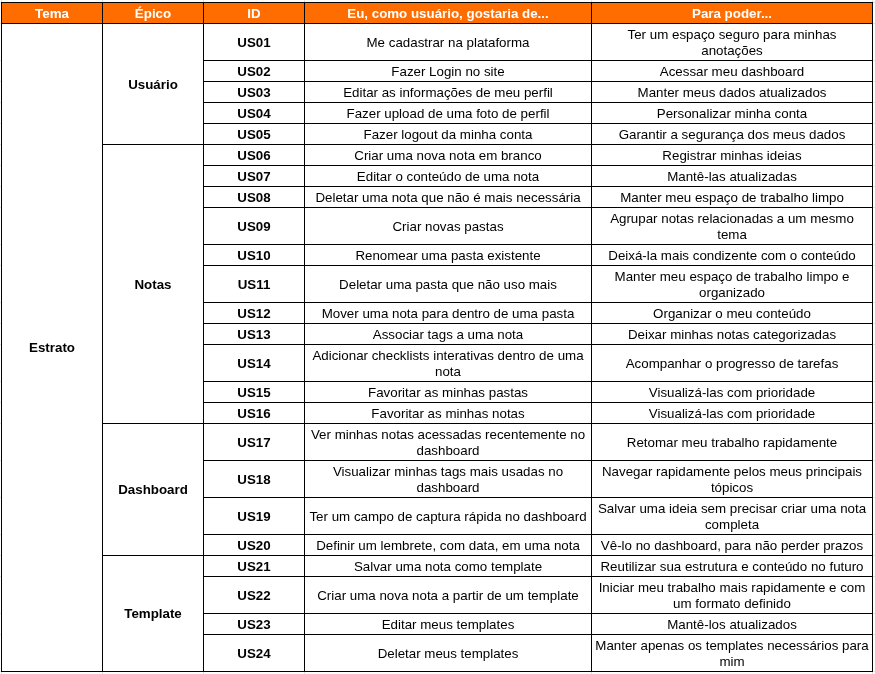

# Procuct Backlog

## 1. Introdução

Este documento representa o Product Backlog do projeto Estrato. Ele é um artefato vivo, que será refinado e atualizado ao longo do ciclo de vida do projeto. O backlog consiste em uma lista ordenada de funcionalidades, melhorias e correções, escritas no formato de Histórias de Usuário (User Stories - US), que, juntas, entregam valor ao usuário final.

---

## 2. Épicos

Um Épico é uma grande história de usuário (ou um grande corpo de trabalho) que é grande demais para ser concluída em um único sprint. Por causa de seu tamanho, um épico é dividido em várias histórias de usuário menores e mais gerenciáveis. No Estrato, os épicos foram divididos em:

- **Usuário**
- **Notas**
- **Dashboard**
- **Template**

---

## 3. Histórias de Usuário

Histórias de Usuário são descrições curtas de funcionalidades, contadas a partir da perspectiva do usuário final. Elas focam no valor que a funcionalidade entrega, e não nos detalhes técnicos, servindo como base para a comunicação e o desenvolvimento centrado no usuário. Para o Estrato, foram definidas as seguintes US:

### 3.1 Épico Usuário

Esse épico abrange as funcionalidades relacionadas à criação, autenticação e gerenciamento da conta do usuário.

| ID    | Eu, como usuário, gostaria de... | Para poder... |
| :---: | -------------------------------- | ------------- |
| **US01**  | Quero me cadastrar na plataforma | Ter um espaço seguro para minhas anotações |
| **US02**  | Fazer Login no site             | Acessar meu dashboard |
| **US03**  | Quero editar as informações de meu perfil | Manter meus dados atualizados |
| **US04**  | Fazer logout da minha conta      | Garantir a segurança dos meus dados |

### 3.2 Épico Notas

Esse épico foca na criação, edição e organização de notas, pastas e tags.

| ID    | Eu, como usuário, gostaria de... | Para poder... |
| :---: | -------------------------------- | ------------- |
| **US05**  | Criar uma nova nota em branco    | Registrar minhas ideias |
| **US06**  | Editar o conteúdo de uma nota    | Mantê-las atualizadas |
| **US07**  | Deletar uma nota que não é mais necessária | Manter meu espaço de trabalho limpo |
| **US08**  | Criar novas pastas               | Agrupar notas relacionadas a um mesmo tema |
| **US09**  | Renomear uma pasta existente     |  Deixá-la mais condizente com o conteúdo |
| **US10**  | Deletar uma pasta que não uso mais | Manter meu espaço de trabalho limpo e organizado |
| **US11**  | Mover uma nota para dentro de uma pasta | Organizar o meu conteúdo |
| **US12**  | Associar tags a uma nota         | Deixar minhas notas categorizadas |
| **US13**  | Favoritar as minhas pastas       | Visualizá-las com prioridade |
| **US14**  | Favoritas as minhas notas        | Visualizá-las com prioridade |

### 3.3 Épico Dashboard

Esse épico agrupa as funcionalidades que ajudam o usuário a visualizar e acessar suas informações mais relevantes.

| ID    | Eu, como usuário, gostaria de... | Para poder... |
| :---: | -------------------------------- | ------------- |
| **US15**  | Ver minhas notas acessadas recentemente no dashboard | Retomar meu trabalho rapidamente |
| **US16**  | Visualizar minhas tags mais usadas no dashboard | Navegar rapidamente pelos meus principais tópicos |
| **US17**  | Ter um campo de captura rápida no dashboard | Salvar uma ideia sem precisar criar uma nota completa |

### 3.4 Épico Template

Esse épico agrupa as funcionalidades que ajudam o usuário a melhorar sua produtividade baseado em templates.

| ID    | Eu, como usuário, gostaria de... | Para poder... |
| :---: | -------------------------------- | ------------- |
| **US18**  | Salvar uma nota como template | Reutilizar sua estrutura e conteúdo no futuro |
| **US19**  | Criar uma nova nota a partir de um template | Iniciar meu trabalho mais rapidamente e com um formato definido |
| **US20**  | Editar meus templates | Mantê-los atualizados |
| **US21**  | Deletar meus templates | Manter apenas os templates necessários para mim |
| **US22**  | Criar templates do zero | Utilizá-los como base para criação de notas |

---

## 4. Product Backlog

A seguir, é possível visualizar o product backlog do Estrato, contendo todas as US definidas anteriormente:

- Para poder visualizar a planilha [clique aqui!](https://docs.google.com/spreadsheets/d/1fDKRcdXv5BMut88IXpOzje3FCZU1iQTfythdHdo6GFI/edit?usp=sharing)

## Fontes

> [1] **Scrum Guide:** "The Product Backlog is an emergent, ordered list of what is needed to improve the product. It is the single source of work undertaken by the Scrum Team." - *Schwaber, K., & Sutherland, J. (2020). The Scrum Guide.*

---

> [2] **Mike Cohn (Autor de "User Stories Applied"):** "User stories are short, simple descriptions of a feature told from the perspective of the person who desires the new capability, usually a user or customer of the system." - *Cohn, M. (2004). User Stories Applied: For Agile Software Development.*

## Histórico de Versões

| Versão | Descrição     | Autor                                            |
| :----: | ------------- | ------------------------------------------------ |
| 1.0    | Adição das US | [André Maia](https://github.com/andre-maia51) |
| 1.1    | Adição do Product Backlog completo | [André Maia](https://github.com/andre-maia51) |
| 1.2    | Adição do novo épico e novas US | [André Maia](https://github.com/andre-maia51) |
