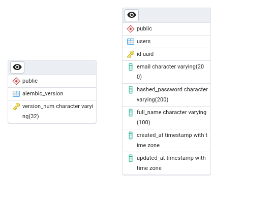
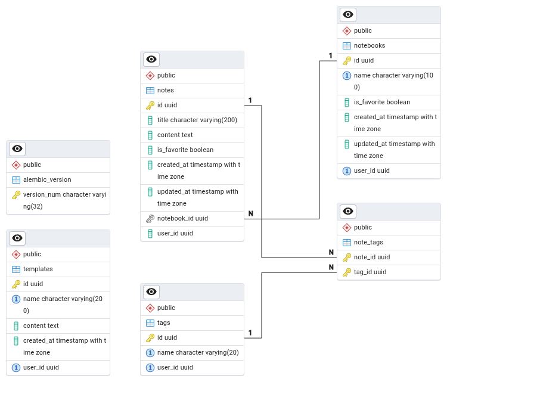

# Documentação do Banco de Dados

O backend do Estrato é dividido em dois serviços, um para autenticação e um para o core da aplicação. Cada serviço possui seu próprio banco de dados e seus próprios esquemáticos.

## Modelo Físico e DDL - Estrato Autenticação

Tanto o Modelo Físico, quanto o DDL foram gerados automaticamente pelo PGAdmin.

### Modelo Físico do Serviço de Autenticação


### DDL do Serviço de Autenticação

```
BEGIN;


CREATE TABLE IF NOT EXISTS public.alembic_version
(
    version_num character varying(32) COLLATE pg_catalog."default" NOT NULL,
    CONSTRAINT alembic_version_pkc PRIMARY KEY (version_num)
);

CREATE TABLE IF NOT EXISTS public.users
(
    id uuid NOT NULL,
    email character varying(200) COLLATE pg_catalog."default" NOT NULL,
    hashed_password character varying(200) COLLATE pg_catalog."default" NOT NULL,
    full_name character varying(100) COLLATE pg_catalog."default" NOT NULL,
    created_at timestamp with time zone DEFAULT now(),
    updated_at timestamp with time zone,
    CONSTRAINT users_pkey PRIMARY KEY (id)
);
END;
```

Para visualizar o arquivo SQL com o DDL: [clique aqui](https://drive.google.com/file/d/1zmo-J6XlUU3DtaVMBT2I57E0zyjrafu7/view?usp=sharing)


## Modelo Físico e DDL - Estrato Core

Tanto o Modelo Físico, quanto o DDL foram gerados automaticamente pelo PGAdmin.

### Modelo Físico do Serviço Core


### DDL do Serviço Core
```
BEGIN;


CREATE TABLE IF NOT EXISTS public.alembic_version
(
    version_num character varying(32) COLLATE pg_catalog."default" NOT NULL,
    CONSTRAINT alembic_version_pkc PRIMARY KEY (version_num)
);

CREATE TABLE IF NOT EXISTS public.note_tags
(
    note_id uuid NOT NULL,
    tag_id uuid NOT NULL,
    CONSTRAINT note_tags_pkey PRIMARY KEY (note_id, tag_id)
);

CREATE TABLE IF NOT EXISTS public.notebooks
(
    id uuid NOT NULL,
    name character varying(100) COLLATE pg_catalog."default" NOT NULL,
    is_favorite boolean,
    created_at timestamp with time zone DEFAULT now(),
    updated_at timestamp with time zone,
    user_id uuid NOT NULL,
    CONSTRAINT notebooks_pkey PRIMARY KEY (id),
    CONSTRAINT uq_user_notebook_name UNIQUE (user_id, name)
);

CREATE TABLE IF NOT EXISTS public.notes
(
    id uuid NOT NULL,
    title character varying(200) COLLATE pg_catalog."default" NOT NULL,
    content text COLLATE pg_catalog."default",
    is_favorite boolean,
    created_at timestamp with time zone DEFAULT now(),
    updated_at timestamp with time zone,
    notebook_id uuid NOT NULL,
    user_id uuid NOT NULL,
    CONSTRAINT notes_pkey PRIMARY KEY (id)
);

CREATE TABLE IF NOT EXISTS public.tags
(
    id uuid NOT NULL,
    name character varying(20) COLLATE pg_catalog."default" NOT NULL,
    user_id uuid NOT NULL,
    CONSTRAINT tags_pkey PRIMARY KEY (id),
    CONSTRAINT tags_name_key UNIQUE (name),
    CONSTRAINT uq_user_tag_name UNIQUE (user_id, name)
);

CREATE TABLE IF NOT EXISTS public.templates
(
    id uuid NOT NULL,
    name character varying(200) COLLATE pg_catalog."default",
    content text COLLATE pg_catalog."default",
    created_at timestamp with time zone DEFAULT now(),
    user_id uuid NOT NULL,
    CONSTRAINT templates_pkey PRIMARY KEY (id),
    CONSTRAINT uq_user_template_name UNIQUE (user_id, name)
);

ALTER TABLE IF EXISTS public.note_tags
    ADD CONSTRAINT note_tags_note_id_fkey FOREIGN KEY (note_id)
    REFERENCES public.notes (id) MATCH SIMPLE
    ON UPDATE NO ACTION
    ON DELETE NO ACTION;


ALTER TABLE IF EXISTS public.note_tags
    ADD CONSTRAINT note_tags_tag_id_fkey FOREIGN KEY (tag_id)
    REFERENCES public.tags (id) MATCH SIMPLE
    ON UPDATE NO ACTION
    ON DELETE NO ACTION;


ALTER TABLE IF EXISTS public.notes
    ADD CONSTRAINT notes_notebook_id_fkey FOREIGN KEY (notebook_id)
    REFERENCES public.notebooks (id) MATCH SIMPLE
    ON UPDATE NO ACTION
    ON DELETE NO ACTION;

END;
```
Para visualizar o arquivo SQL com o DDL: [clique aqui](https://drive.google.com/file/d/10A-jQIcOXvW1Ut0urL9lF3XY-IAqV1Ni/view?usp=sharing)