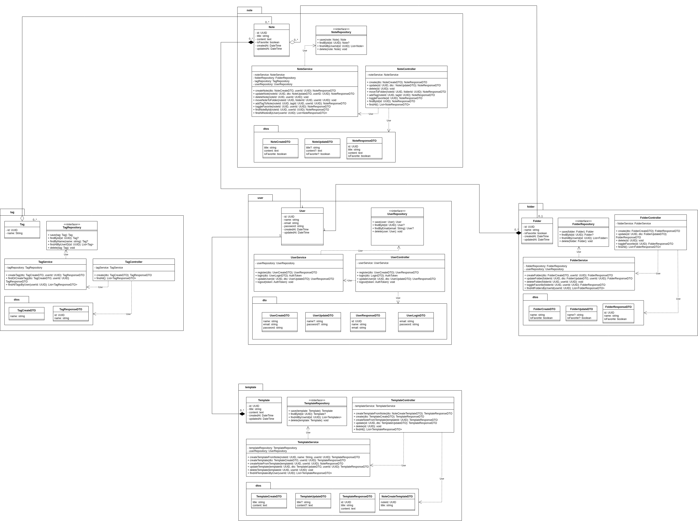

# Diagrama de Classes (UML)

O Diagrama de Classes da UML é o blueprint que descreve a estrutura estática do sistema. Ele visualiza as classes do software, seus atributos, métodos e os relacionamentos entre elas, servindo como um guia essencial para a implementação e manutenção do código-fonte.

## 1. Diagrama de Classes

A seguir, é possível visualizar o Diagrama de Classes do Estrato:

### 1.1 Imagem do Diagrama

### 1.2 Link para o Draw.io

<iframe
frameborder="0"
style="width:100%;height:380px;"
src="https://viewer.diagrams.net/?tags=%7B%7D&lightbox=1&highlight=0000ff&edit=_blank&layers=1&nav=1&title=class_diagram_estrato.drawio&dark=auto#R%3Cmxfile%3E%3Cdiagram%20id%3D%22C5RBs43oDa-KdzZeNtuy%22%20name%3D%22Page-1%22%3E7VtRc9o4EP41vNxMMpZlG%2FOYQNPrXdrJXZJr%2B6hgBTSVLSqLAP31XWEZsESAEBznGGYyibVeLdLut%2Fut7NDC3XT6UZLR8LNIKG%2F5XjJt4V7L9zshgt9aMCsEQdwuBAPJkkKEloJb9osaoWekY5bQvKKohOCKjarCvsgy2lcVGZFSTKpqj4JXP3VEBtQR3PYJd6VfWaKGhTT220v5n5QNhuUno6hT3ElJqWx2kg9JIiYrIvyhhbtSCFVcpdMu5dp3pV%2B%2Bfpp95dc%2Foo9%2F%2FZP%2FJPeXf999%2Be%2BsMHb1kimLLUiaqb1N5zR5yJ9Y9vDruvuTfpvIx44wU7wnwsfGX%2Fc5lWa%2FalY6MZ%2BwlJMMRpePIlO35g6CMeFskMF1H9YGM%2FHlE5WKgf8vzA0lRiDtDxlPrslMjPUOckX6P8rR5VBI9gvMEm5swm2pDJT8qKJxq2eC2AOppDno3JRuQZboM5lWFK9JroygLzgno5w9LLaREjlg2aVQSqRGaTJkit6OSF%2FrTCA59EJUWi7SeA52S6cW1LbECS3AA0lHRUqVnME8YwVrI9qOSTjciYrxZAlfFJnADVehG8QmbUzKDBa2l7CAC4OMF6AEOSg5M1Mu4O%2F9%2FScQRVyHMmFPcDnQl1olIyktlHIlWTYo1WAVK5rPTKYpYXzv2SOS5xMhk%2F0NSPHIOL1hfTWW9F7uv5S%2BpETR5EIVFnowuGPgmJfYGI%2BSV9koRQ%2FSlthTrdQHdKt5Skrxg3YFF5DjvUwUtYBxbonKcsDpo3q2GOSQVODE67lOL1hK%2FjVo1iIBcx%2F5vOAOWZLQTCeyUESRImt1io4Ey9Qc7eEl%2FEBSdL3zsBXCwrswRssx%2FGh1qboig70QNs9QCiVhQnVZOEi2P19i3Ww32e3vmtwoqCm5fSe5HQxwNo9tgYGSRdFeAEghlJwuI36nAdE7Qw4qsIsKvAYBnDxQfiNyppjQ9mWhayFjW%2FCr6GbZkEqmaow6Crzdwl5XRY%2BdoF9BY3Vi%2FkaZH3mdCvOHZZO6vTjUhZNOI8zP8ivyBIFXxsQDHBgoyV5Mdu%2BFh08UWy%2FFxgeh2LguhkXuKetEsa%2Bn2M1RR6hhikVuY%2FVFQEU7MWxzDGufrSM%2FbPxsjfelWMUU359j%2BxDyuSv1%2FDkDvSVDaxuSpiyDnlNz6CsYuQFWP%2FH3Yfm7KJXv%2BIxcGj4x%2BEEZfEvcGz8lo8gJ%2Bx0ZnBi8QQYPQ%2BuMjHdk8HZtIGm%2F%2Fox8u5G%2FT3RzYLqJDkI3QW1s4z6dO7HNAdhmc9jbDZON775lc6JOs%2BRCvxOHUcJIKrLkbsh0GsKNK8bL1IBRyQ9BNWmkGEPLnZhIgb%2Fk7NtiEgy%2B6zuQn2bYm65q9mblaMrUt5XrlVkwWk7Sg3JOsReaOG%2Frd6EDcIIYyz7dFF1ThoEcB3QjDNajYF3YJeVEsafqitcF3pi70QjfwFWxVzVRbMrMWn11bxkKAttQWDVUbNoxBFghsxU1k4HPLxjbn4M3rsvWD9odKw2KFSyTYuHwV%2BSJ%2B1ylxIjDkSvI39qJLcrgOt6p5k1dzU3QsfwZus0NXnfwseBwuJrkPpzwzs%2F%2FOBJ3hxhbcPcbdnd4tNDGbVT1deB2WW%2Fra%2Fdsd0TQtt0drXka%2Frbu3qGnrau7WQxe2N0sOprvqw1NI91N%2FO6aG4ysXsGGzs7NTXuLoQM1NyhuollxX6AfS0X3bX823axg9zXrEVX0Rd4u0qThZgW7ffjbVfRlEf%2FeWjm%2B%2Fo8qehm%2BrSX9mf8kq6Ok%2B1uOmTuX9Hi%2F8%2Bqhqi52jy2boClGdBMmIVK7YPLMO%2Fc860GKF2%2BFph7dUMlgz7r0VPCK3tHzlc6uHQh%2BM7z6URVm0d4tiL%2FF0IFaEN8634edcOO6bP0oqnzFo56WBbvvOo%2BIRu2uJYrc%2F7F8Wxp1z%2Fzg7qNpEq0UDdvxedNtonvwr48cFo1HpxNUijnyN5dzPXBoYc%2F2p%2FZWBu%2FKDc%2B8ganj2Tuy83xPbojaWwwdiBsivP5z6q317rvrI6r1kVc9MkUlUBsrPe5DsCNydxBXH6fXSK0wXH7vtkiG5ZeX8Yff%3C%2Fdiagram%3E%3C%2Fmxfile%3E"
></iframe>

---

## Fontes

> **Martin Fowler (Autor de "UML Distilled"):** "The class diagram is the glory of the UML [...] it shows the static structure of the classes in your system." - *Fowler, M. (2003). UML Distilled: A Brief Guide to the Standard Object Modeling Language.*

## Histórico de Versões

| Versão | Descrição     | Autor                                            |
| :----: | ------------- | ------------------------------------------------ |
| 1.0    | Adição do Diagrama de Classes | [Andre Cláudio](https://github.com/andre-maia51) |
