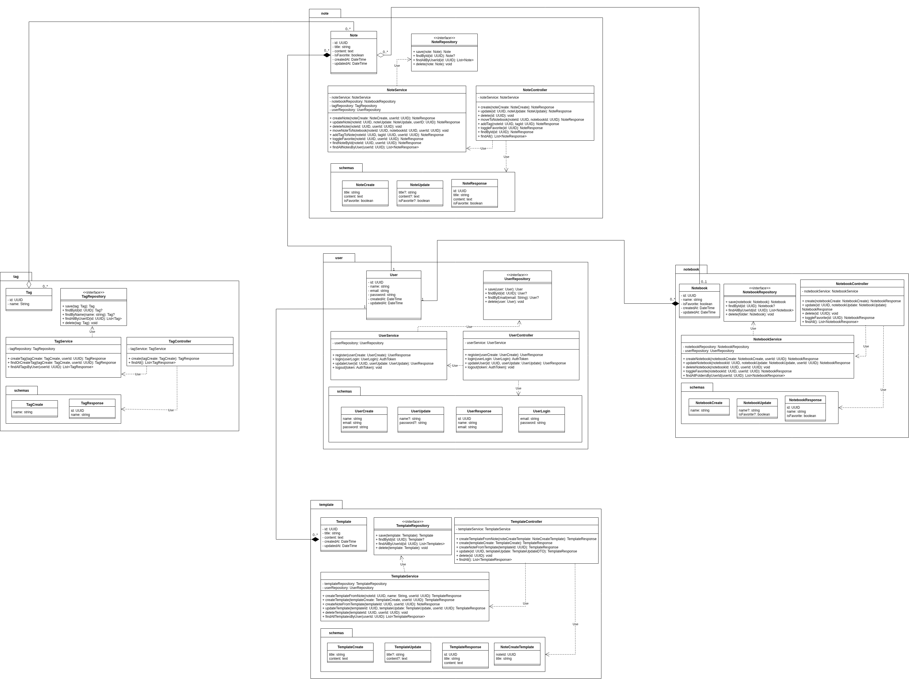

# Diagrama de Classes (UML)

O Diagrama de Classes da UML é o blueprint que descreve a estrutura estática do sistema. Ele visualiza as classes do software, seus atributos, métodos e os relacionamentos entre elas, servindo como um guia essencial para a implementação e manutenção do código-fonte.

## 1. Diagrama de Classes

A seguir, é possível visualizar o Diagrama de Classes do Estrato:

### 1.1 Imagem do Diagrama

### 1.2 Link para o Draw.io

<iframe
frameborder="0"
style="width:100%;height:500px;"
src="https://viewer.diagrams.net/?tags=%7B%7D&lightbox=1&target=blank&highlight=0000ff&layers=1&nav=1&dark=0#G1gMmua5wx4IcNxYJ1bCQot83bTBaT0ccF"
></iframe>

---

## Fontes

> **Martin Fowler (Autor de "UML Distilled"):** "The class diagram is the glory of the UML [...] it shows the static structure of the classes in your system." - *Fowler, M. (2003). UML Distilled: A Brief Guide to the Standard Object Modeling Language.*

## Histórico de Versões

| Versão | Descrição     | Autor                                            |
| :----: | ------------- | ------------------------------------------------ |
| 1.0    | Adição do Diagrama de Classes | [André Maia](https://github.com/andre-maia51) |
| 1.1    | Atualização do Diagrama com a nova classe | [André Maia](https://github.com/andre-maia51) |
| 1.2    | Refatoração do Diagrama | [André Maia](https://github.com/andre-maia51) |
